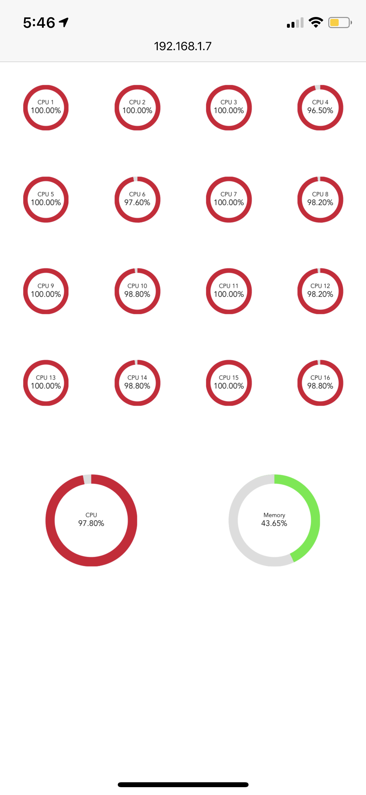
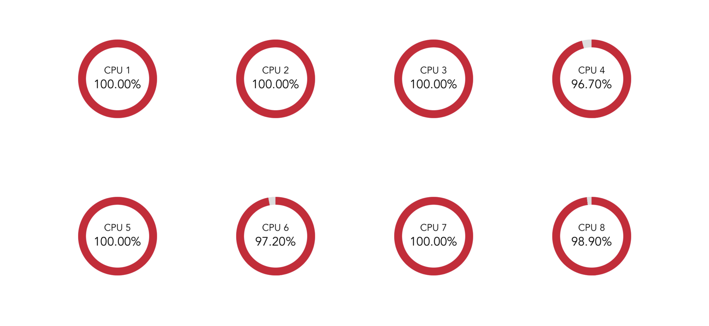

# Remote Resource Monitor

This is a simple vue project to display CPU and memory usage nicer on your other devices such as mobiles and tablets.

** Need to install [Glances](https://nicolargo.github.io/glances) and have it running as web server mode "glances -w"

Using [localhost](http://localhost:61208) for the Glances API will only work on the same machine. To this webapp working from other devices, you need to change to your machine's IP address, e.g. 192.168.1.7, and then you can browse to http://192.168.1.7:8080 from your devices whether you use "npm run serve" or "http-server dist"

## Portrait mode


## Landscape mode


## Project setup
```
npm install
```

### Compiles and hot-reloads for development
```
npm run serve
```

### Compiles and minifies for production
```
npm run build
```

### Lints and fixes files
```
npm run lint
```

### Customize configuration
See [Configuration Reference](https://cli.vuejs.org/config/).


### Run from dist folder
```
http-server dist
```
You can also build the project once and run directly from "dist" folder with [http-server](https://www.npmjs.com/package/http-server)


### License
MIT License &copy; Mitch Leung
